# Does Learning a Wavelet Help? Perfect-Reconstruction Constraints Enable Learnable Wavelets for Low-Dose CT Denoising

> **会议版草稿 v2.0** — 2026-09-16
> 目标：EI 会议（ICIP 5+1 页格式，可适配 ICME 6 页 / EUSIPCO 5 页）
> 所有数字均来自已完成的实验，**无占位符**。
>
> v2.0 相对 v1.0 的变化：
>   - 新增 §5.2.1（独立重下数据的复现 + 训练协议可复现性更正）
>   - 新增 §5.4（变换学到什么 / 数值崩溃是悬崖 / 默认 bound 偏紧 / 容量假设被否定）
>   - 修掉四处会被审稿人一行推翻的硬伤（假 p 值、图 2 题注谎报 n、无出处的
>     "独立验证"、identity 地板差点被静默覆盖）
>   - 图从 4 张增加到 17 张，正文与附录全部接上引用

---

## Abstract

Making the wavelet transform learnable is a natural extension of wavelet-domain
image denoising. We show that for low-dose CT, this extension **fails by default**:
an unconstrained learnable analysis–synthesis pair drifts away from invertibility
during training, and the resulting network performs **no better than a fixed Haar
basis**. Our design resolves a **0.136 dB** effect at $n=5$ seeds, and the
unconstrained–fixed gap is **0.025 dB — 5.6× below that floor** — so we state the
result as a bound rather than an absence: any real difference is smaller than
**0.14 dB**, roughly **half** the benefit that perfect reconstruction later
delivers. We trace the failure to the transform's reconstruction error, which
reaches **11–18%** after training. We show this is **causal, not merely
correlated**: injecting a controlled error of the same magnitude into the
perfect-reconstruction arm degrades it to the fixed-Haar level. Imposing
perfect reconstruction *by construction* — parameterizing the wavelet as a lifting
scheme whose inverse shares the forward filters — makes learning pay off:
**+0.30 dB over unconstrained learning (p = 0.0005, $d_z$ = 4.67) and +0.27 dB over
fixed Haar (p = 0.0004, $d_z$ = 4.78)** — large effects, not marginal ones,
consistent across two data splits. The resulting network has
**2,159 parameters** and reaches **31.97 dB** on AAPM-Mayo 2016, within 1.0 dB of
a RED-CNN baseline trained under the identical protocol at **857× fewer
parameters**.

Two further results locate the effect. First, the transform learns *little*: from
any numerically intact starting point, training converges to a narrow band of
drift from Haar and, starting **at** Haar, moves **away** — the optimum is
slightly off Haar, which is why adaptation buys so little here. We also reject
the natural explanation that the heads simply substitute for the transform: the
PR advantage does not shrink as head capacity grows by two orders of magnitude.
Second, the failure mode is a **cliff, not a slope** — once the forward
transform's round-trip error exceeds the signal, the gradient carries no
information and training cannot recover (drift 4.0 stays at 4.000 and 3.29 dB,
where drift 2.0 recovers fully). Being inside the numerical envelope is
therefore binary, which is why bounding is necessary — and why the bound's
value matters more than expected: our default costs **+0.10 to +0.15 dB**, about
half the entire PR effect.

---

## 1. Introduction

Low-dose CT (LDCT) reduces radiation exposure at the cost of increased noise.
Deep denoising networks such as RED-CNN [1] are effective but parameter-heavy
(∼10⁶ parameters), which limits deployment on the resource-constrained
workstations common in smaller clinical sites. Compact models are therefore
attractive.

Wavelet-domain processing is a classical way to separate noise from structure,
and recent work has made the wavelet itself **learnable** to adapt to a specific
modality and dose [17], [18], [19], [20], [21], [22]. This paper asks a simple
question:

> **Does making the wavelet learnable actually help?**

Recent invertible-wavelet denoisers [19], [20] build perfect reconstruction
(PR) into their architectures. Whether that structure is *what makes learning
pay* has never been tested: prior work **assumes** invertibility, so it cannot
observe its absence. Our answer, from a controlled three-arm study that makes
invertibility **optional** while holding capacity, split, schedule and evaluation
fixed, is: **learning pays only if the transform is kept invertible by
construction.**

Parameterizing the wavelet as a **lifting scheme** [23], [24] — the inverse
*reuses* the forward prediction/update filters rather than being a second set of
parameters — makes learning pay off: **+0.30 dB over unconstrained learning and
+0.27 dB over fixed Haar**, at large effect size ($d_z \approx 4.7$), replicated
on a second split and on SSIM.

The inverted case is equally informative. An unconstrained learnable
analysis–synthesis pair performs **statistically indistinguishably from a fixed
Haar basis**. We are careful how we state this: the design resolves a 0.136 dB
effect at $n=5$ seeds, whereas the unconstrained–fixed gap is 0.025 dB —
**5.6× below that floor**. So we report a **bound**, not an absence: any genuine
difference is smaller than **0.14 dB**, roughly half of what PR delivers. A weak
experiment could not have resolved the effect that PR produces.

**Why** it fails is the substance of the paper. After training, the unconstrained
pair loses **11–18%** of the signal in a forward–backward pass, against
**1.6e-07** for both invertible arms. We show this is **causal, not merely
correlated**: holding architecture, capacity and protocol fixed, we inject a
controlled round-trip error into the PR arm, and it degrades **monotonically** to
the fixed-Haar level (8.7% error → 30.5500 dB, against 30.5591 dB for an arm that
never learned anything; $p \le 0.007$ at every dose). Prior invertible-wavelet
denoisers cannot observe this state, because their designs make it unreachable.

**Contributions.**
1. **A missing control**, and the negative result it exposes: with capacity and
   protocol held fixed, an unconstrained learnable wavelet gives no benefit over
   fixed Haar — reported as a **bound of 0.14 dB**, not as an absence.
2. **A causal mechanism**, established by intervention rather than correlation:
   a round-trip error of the same magnitude is *sufficient* to destroy the
   benefit, monotonically and significantly (n = 5 seeds, p ≤ 0.007 at every
   dose). Prior invertible-wavelet denoisers cannot observe this state.
3. **A numerical envelope, and what happens outside it.** Structural PR does not
   enforce itself in float32. We characterise the boundary in two ways. By a
   controlled sweep of tap magnitude, the round-trip error grows from 3.6e-07 at
   $|{\rm taps}| \approx 1.0$ to 5.2e+00 at $\approx 5.3$ (*a controlled analysis
   of the parameter regime, not a training-drift measurement*). And by
   initialising the taps at a known distance from Haar, we show that crossing
   this boundary is a **cliff**: at drift 4.0 the forward transform emits noise,
   the gradient carries no information, and training stays exactly where it
   started (final drift 4.000, 3.29 dB), whereas drift 2.0 recovers fully. Being
   inside the envelope is therefore not a matter of degree — which is why we
   bound the taps, and why the bound's value matters more than we expected
   (§5.4).
4. **What the transform actually learns.** From any numerically intact starting
   point, training converges to a **narrow band of drift from Haar
   ($\approx$0.65–0.78)**; starting *at* Haar, it moves away. The optimum is
   therefore slightly off Haar, which is the concrete reason "learning" buys so
   little here. We also test — and reject — the natural hypothesis that the heads
   simply substitute for the transform: the PR advantage does not shrink as head
   capacity grows by two orders of magnitude.
5. **A 2,159-parameter network** that comes within 1.0 dB of a same-protocol
   RED-CNN baseline at **857× fewer parameters**.

---

## 2. Related Work

**Low-dose CT denoising.** Convolutional encoder–decoders such as RED-CNN [1]
established the field, followed by adversarial [2], [3] and, more recently,
transformer- and diffusion-based methods [4]–[11]. These improve fidelity but at
10⁵–10⁷ parameters. A parallel line targets efficiency instead: MLAR-UNet [13],
CT-Mamba [15], AMFA-Net [16] and MobileMamba-UNet [12] all report competitive
results at far lower cost, the last of these also operating in a wavelet domain.
We share the efficiency goal but ask a different question — not *how small can a
denoiser be*, but *does making the transform itself learnable help at all*.

**Wavelet-domain and multiresolution denoising.** Wavelet shrinkage [27], [28]
separates noise from structure by thresholding subband coefficients. Multi-level
wavelet CNNs [17], [18] fold this structure back into deep networks, and recent
LDCT methods pair wavelets with diffusion [11] or state-space models [12]. In all
of these the transform is a **fixed** operator; the learnable capacity sits in
the network around it.

**Learnable transforms and invertibility.** A separate line makes the transform
itself learnable. LINN [19] learns lifting prediction/update steps around a
*fixed* undecimated Haar transform; WINNet [20] additionally learns the splitting
operator, constrained to be orthogonal via a Cayley transform so that PR is
preserved by construction. Both therefore **build invertibility into the
architecture**. Classical filter-bank theory [25], [26] supplies the PR
conditions, the lifting scheme [23], [24] is the standard construction that
satisfies them by design, and orthogonality has separately been used in CNNs to
condition optimisation [30].

**The closest prior result, engaged directly.** WINNet's Table II ablation
compares decimated and undecimated Haar, DCT of several sizes, and learned Cayley
operators on natural-image AWGN denoising, and reports that the **learned**
operator performs *similarly to a fixed DCT* — whereupon they default to the
fixed one. This superficially resembles our negative result, so we address it here
rather than leave it for a reviewer. Two differences matter. First, their learned
operator is constrained to be orthogonal, so PR holds throughout: their comparison
is between two *invertible* transforms, whereas ours is between invertible and
**non**-invertible ones — the failure we diagnose is not reachable in their
design, and neither paper reports a round-trip measurement anywhere. Second,
theirs is a default-picking ablation without significance testing; ours is a
five-seed paired comparison with confidence intervals.

**Our position.** We propose neither a new wavelet nor a new architecture — the
lifting construction in §3.2 is LINN's and WINNet's, and WINNet already learns
the filter taps while preserving PR. What is new is the **missing control**.
Prior invertible-wavelet denoisers *assume* structural invertibility and never
test its absence, and so cannot report what happens without it. Making a
learnable transform's invertibility *optional*, holding capacity and training
fixed, and measuring the consequence — and the six-order-of-magnitude round-trip
gap that explains it — is the contribution. §5.2 returns to the residual tension
with WINNet's ablation.

---

## 3. Method

### 3.1 Overview

```
noisy CT x
  ↓ PR-LWT decomposition (2 levels, 7 subbands)
  ↓ per-subband residual prediction:  δ_b = head_b(band_b)
  ↓ cleaned subbands:  clean_b = band_b − δ_b
  ↓ PR-LWT reconstruction
denoised x̂
```

### 3.2 PR-LWT: a perfectly-reconstructible learnable wavelet

We use the **lifting scheme**. In 1-D, with even/odd splitting:

```
Analysis:   d = x_o − P(x_e)        s = x_e + U(d)
Synthesis:  x_e = s − U(d)          x_o = d + P(x_e)
```

Crucially, **synthesis reuses the same P and U** as analysis. Invertibility is
therefore a property of the *structure*, not of the learned values: for any
P, U, `reconstruct(decompose(x)) = x` up to floating point.

The 2-D transform is separable (lifting along height, then width), giving
`{LL₂, LH₂, HL₂, HH₂, LH₁, HL₁, HH₁}`. We initialize `P = [0,1,0]` (identity
prediction) and `U = [0,0.5,0]`, plus a √2 output scaling, so that the
initialization is **exactly orthonormal Haar** (verified to 2e-7 on all four
subbands).

**Parameter bounding is necessary, not optional.** We parameterize
`P = P_init + 0.5·tanh(θ_P)` and `U = U_init + 0.5·tanh(θ_U)`. Without this, the
taps drift to |P| ≈ 5, at which point the float32 round-trip error degrades from
3.6e-07 to 5.2e+00. Perfect reconstruction holds unconditionally in exact
arithmetic; bounding is what makes it *usable* in float32.

**Parameter count**: 2 levels × 2 directions × 2 filters × 3 taps = **24**.

### 3.3 Subband denoising heads

Each subband is processed by a lightweight head (`conv3×3 → ReLU → conv3×3`,
16 internal channels) that predicts a **residual** (signed, no final activation).
Seven heads contribute 2,135 parameters; the complete network has **2,159**.

### 3.4 Training

Loss: L1 between prediction and ground truth. Adam, lr 1e-3, 30 epochs,
128×128 random patches, batch size 8.

---

## 4. Experimental Setup

### 4.1 Data

**AAPM-Mayo 2016 Low Dose CT Grand Challenge**, 3 mm B30 paired subset:
10 patients, 2,378 quarter-dose / full-dose 512×512 slice pairs.
Slices are paired by `ImagePositionPatient[2]` (z position); pairing by filename
is **not** possible because the slice-index field is identical on both sides.

### 4.2 Evaluation protocol

AAPM never defined a PSNR protocol (its official metric was radiologist
reading), and at least five mutually incompatible conventions coexist on this
dataset. We adopt the **RED-CNN / CTformer lineage** convention, used verbatim by
six public repositories:

```
preprocess  x = (HU + 1024) / 4096            (no clipping)
evaluate    denormalize to HU; clip both prediction and reference to [-160, 240]
            PSNR = 10·log10(400² / MSE_HU),  data_range = 400
            SSIM per SSinyu/RED-CNN measure.py
aggregate   per-slice metrics, then mean
```

The identity baseline under this protocol is L506 29.2489, L067 26.5576,
combined 27.8630 dB. **We do not claim these as an independent confirmation.**
They are computed by our own implementation and, to our knowledge, agreement at
the 0.01 dB level across published work on this dataset is *not* achievable in
general: independent re-analyses of the same cohort differ by up to **~2 dB**
(e.g. a third-party report of 27.24 dB on L506 against our 29.2489), and the
Eulig et al. benchmark places its identity-equivalent reference 0.8 dB away.
Cross-paper PSNR on AAPM-Mayo therefore carries a noise floor of roughly 2 dB,
which is why every claim in this paper is made against **same-protocol
baselines** rather than against quoted numbers.

### 4.3 Splits

Two patient-level splits are used to show robustness:

| Split | Train | Val | Test |
|---|---|---|---|
| **S1** (main) | 7 patients (1,600 slices) | L291 | L506 + L067 (435) |
| **S2** (literature-aligned) | 8 patients (1,943) | L067 | **L506 only** (211) |

S2 aligns with the convention used by published work so that numbers are
directly comparable.

### 4.4 The floor: doing nothing

Identity (output = input) is the floor every model must beat. All ten patients,
sorted by PSNR (`experiments/identity_floors.py` → `identity_floors.json`):

| Patient | n | identity PSNR | SSIM | Appears as |
|---|---|---|---|---|
| L143 | 234 | 25.4991 | 0.7643 | train (both splits) |
| L310 | 214 | 26.2577 | 0.7273 | train (both splits) |
| L067 | 224 | 26.5576 | 0.7987 | S1 test / S2 val |
| L109 | 128 | 26.6052 | 0.8165 | train (both splits) |
| L096 | 330 | 26.9097 | 0.7853 | train (both splits) |
| L291 | 343 | 26.9805 | 0.8088 | S1 val / S2 train |
| L333 | 244 | 27.2508 | 0.8305 | train (both splits) |
| L192 | 240 | 28.2896 | 0.8344 | train (both splits) |
| L286 | 210 | 29.1479 | 0.8103 | train (both splits) |
| L506 | 211 | 29.2489 | 0.8759 | test (both splits) |
| *S1 test, combined* | *435* | *27.8630* | *0.8361* | |
| *S2 test (L506)* | *211* | *29.2489* | *0.8759* | |

The spread across patients (**25.50 – 29.25 dB**, a 3.75 dB range) is larger than
any effect we report, so **all results are reported per patient**.

---

## 5. Experiments

### 5.1 Main results

| Split | Method | Params | PSNR | SSIM |
|---|---|---|---|---|
| S1 | identity | — | 27.8630 | 0.8361 |
| S1 | **PR-LWT (ours)** | **2,159** | **30.8314 ± 0.0815** | **0.8762 ± 0.0011** |
| S1 | RED-CNN [1] (ours, same split) | 1,848,865 | 31.8310 | 0.8824 |
| S2 | identity (L506) | — | 29.2489 | 0.8759 |
| S2 | **PR-LWT (ours)** | **2,159** | **31.9731 ± 0.0787** | **0.9041 ± 0.0008** |
| S2 | RED-CNN [1] (ours, same split) | 1,848,865 | **32.9471** | **0.9090** |
| S2 | RED-CNN [1] (as published) | ~10⁶ | ≈ 32.93 | — |
| S2 | CTformer [4] (as published) | ~1.4×10⁶ | ≈ 32.9 | — |

**The baselines marked *ours* were trained by us under the identical protocol** —
same splits, same patch size, batch size, optimiser, schedule and evaluation — so
the comparison no longer rests on matching a published setup. Two observations
follow.

First, an **independent check of our protocol**: on the literature-aligned split
S2 our RED-CNN reaches **32.9471 dB on L506**, within **0.02 dB** of the
independently published 32.93 dB for the same patient [1]. Our implementation and
our evaluation convention therefore reproduce the reference result rather than
merely resembling it.

Second, under that matched comparison, PR-LWT comes within **0.97 dB** (S2) and
**1.00 dB** (S1) of RED-CNN while using **857× fewer parameters** (2,159 vs.
1,848,865). We state plainly that **PR-LWT does not beat RED-CNN on PSNR**; the
claim under test in this paper is about *what makes a learnable transform
helpful*, not about attaining state of the art.

### 5.2 Ablation: is invertibility the key?

**Three arms**, differing *only* in the wavelet:

| Arm | Wavelet | Learnable | Invertibility guaranteed | Wavelet params |
|---|---|---|---|---|
| `pr` | lifting scheme | ✓ | **✓ (structural)** | 24 |
| `unconstrained` | separate analysis/synthesis filters | ✓ | ✗ | 64 |
| `fixed` | orthonormal Haar | ✗ | ✓ | 0 |

The arms answer two distinct questions: `pr` vs `unconstrained` isolates the
effect of **invertibility**; `pr` vs `fixed` isolates the effect of
**learnability**.

**Results** (Fig. 1; mean ± std over seeds; paired t-test with the **training
seed** as the independent unit):

| Split | Arm | PSNR | n |
|---|---|---|---|
| S1 | `pr` | **30.8314 ± 0.0815** | 5 |
| S1 | `unconstrained` | 30.5341 ± 0.0305 | 5 |
| S1 | `fixed` | 30.5591 ± 0.0256 | 5 |
| S2 | `pr` | **31.9731 ± 0.0787** | 3 |
| S2 | `unconstrained` | 31.6788 ± 0.0307 | 3 |
| S2 | `fixed` | 31.6936 ± 0.0394 | 3 |

**Paired comparisons:**

| Split | Comparison | Δ (dB) | t | p | 95% CI | Cohen's $d_z$ | $\lvert\Delta\rvert$ / MDES |
|---|---|---|---|---|---|---|---|
| S1 | `pr` − `unconstrained` | **+0.2973** | 10.44 | **0.0005** | [+0.218, +0.376] | **+4.67** | **2.19×** |
| S1 | `pr` − `fixed` | **+0.2723** | 10.68 | **0.0004** | [+0.202, +0.343] | **+4.78** | **2.01×** |
| S1 | `unconstrained` − `fixed` | −0.0251 | −2.02 | 0.113 | [−0.060, **+0.009**] | −0.90 | 0.18× |
| S2 | `pr` − `unconstrained` | **+0.2942** | 7.92 | **0.016** | [+0.134, +0.454] | **+4.57** | 1.21× |
| S2 | `pr` − `fixed` | **+0.2794** | 10.95 | **0.008** | [+0.170, +0.389] | **+6.32** | 1.15× |
| S2 | `unconstrained` − `fixed` | −0.0148 | −1.25 | 0.337 | [−0.066, **+0.036**] | −0.72 | 0.06× |

#### 5.2.1 Independently re-acquired data, ten seeds per arm

Between the original experiments and this write-up the dataset had to be
**re-acquired from scratch**: the official AAPM Box distribution became
unreachable, the Kaggle mirror that replaced it was withdrawn mid-download, and
the copy used here was reassembled from a partial archive whose 3-mm B30 region
contains holes (L067 is missing 13 slices, L506 one, giving a **421-slice** test
set instead of 435). Because the data therefore differs, every headline result
was re-run end to end.

This turned out to be useful: it is a **de facto replication**, and the two
protocol changes it forced are worth stating, because both are corrections.

**(a) The training protocol was not reproducible.** Random patch cropping drew
from an unseeded generator, so a given `--seed` did not reproduce a run; repeated
runs with the same seed differed by $\sim$0.04 dB. All numbers below come from
the corrected, seed-deterministic pipeline, which reproduces **bit-identically**
(verified: two runs of the same seed give the same PSNR to ten decimal places).

**(b) The re-run is better powered.** Ten seeds per arm instead of five, which
tightens the detection floor from **0.136 dB to 0.074 dB** (Fig. 14). Fig. 10
places the two acquisitions side by side; Fig. 13 shows the running mean and
its 95% CI as seeds accumulate.

| Split | Arm | Original (435 slices, $n$=5) | Re-acquired (421 slices, $n$=10) |
|---|---|---|---|
| S1 | `pr` | 30.8314 ± 0.0815 | **30.8575 ± 0.0740** |
| S1 | `unconstrained` | 30.5341 ± 0.0305 | 30.5427 ± 0.0460 |
| S1 | `fixed` | 30.5591 ± 0.0256 | 30.5739 ± 0.0497 |

**Paired comparisons on the re-acquired data:**

| Comparison | Δ (dB) | $p$ | Cohen's $d_z$ | $\lvert\Delta\rvert$/MDES | Original Δ |
|---|---|---|---|---|---|
| `pr` − `unconstrained` | **+0.3148** | **<0.0001** | **+5.13** | **4.28×** | +0.2973 |
| `pr` − `fixed` | **+0.2837** | **<0.0001** | **+5.04** | **3.85×** | +0.2723 |
| `unconstrained` − `fixed` | **−0.0312** | **0.0163** | −0.93 | 0.68× | −0.0251 ($p$=0.113) |

**Both positive findings replicate, with larger effect sizes** ($d_z$ = 5.13 and
5.04 against 4.67 and 4.78), and the ordering is unchanged. The third row
*changes character* and we report it as such: on the original data the
`unconstrained` − `fixed` gap was indistinguishable from zero; here it is
marginally significant **in the negative direction**. Unconstrained learning is
therefore not merely useless but slightly *harmful*, though we would not press a
$0.03$ dB effect that sits at $0.68\times$ the detection floor.

**What this does and does not license.** The paired *ratios* replicate cleanly;
the absolute levels are not directly comparable across the two acquisitions,
because the test set is 14 slices smaller and its identity floor shifts
accordingly (27.8630 $\to$ 27.9220 dB). Every comparison above is
like-for-like *within* its own acquisition, which is the form in which we use
them.

**Effect sizes are large, not marginal.** The two significant comparisons carry
$d_z$ = +4.67 and +4.78 (S1), well beyond the conventional "large" threshold of
0.8. The claim is therefore not that PR-LWT buys a small improvement, but that it
moves the network by a large, consistent margin relative to seed-to-seed
variation.

**SSIM reproduces the same ordering.** The three-arm pattern is not a
PSNR artefact. On SSIM, `pr` reaches **0.8762 ± 0.0011** (S1) / **0.9041 ±
0.0008** (S2), against 0.8725 / 0.8729 (S1) for the other two arms: `pr` −
`unconstrained` = **+0.0037** ($p$ = 0.0008, $d_z$ = +4.07) and `pr` − `fixed` =
**+0.0033** ($p$ = 0.0016, $d_z$ = +3.40), with the same direction on S2
(+0.0029 both, $p$ = 0.030 / 0.015).

One honest wrinkle: on SSIM the `unconstrained` − `fixed` gap is *marginally*
significant in the **negative** direction on S1 (−0.0004, $p$ = 0.039), whereas
on PSNR it was not ($p$ = 0.113); on S2 it is exactly zero (+0.0000,
$p$ = 0.985). Unconstrained learning is therefore never *better* — on one split
it is detectably *worse* — but we do not read a stable effect into a
$4\times10^{-4}$ SSIM difference that vanishes on the other split.

> **Comparability note.** SSIM is computed with our own implementation
> (`gaussian_weights=True`, $\sigma$ = 1.5, win size 11, `data_range` = 400),
> which is used identically for every arm and for our RED-CNN reproduction, so
> all comparisons **within** this paper are like-for-like. Its agreement with
> the SSIM of the reference RED-CNN/CTformer code was **not** independently
> verified, so we do not compare our SSIM against *published* SSIM values. The
> same caution applies to PSNR across papers: §4.2 documents a ~2 dB cross-paper
> noise floor on this dataset, so all quantitative comparisons here are against
> **same-protocol** baselines — the same-split RED-CNN reproduction in §5.1, and
> the arms of the three-way ablation — never against quoted numbers.

**What this experiment can and cannot detect (Fig. 5).** Because the null result
carries much of the argument, we quantify the design's resolution directly. For a
paired *t*-test at 80% power, the minimum detectable effect (MDES) at $n=5$ is
**0.136 dB** (S1); at $n=3$ it is 0.244 dB (S2) — these are the $\lvert\Delta\rvert$/MDES
denominators above. Two consequences follow:

- The **PR benefit is detectable**: +0.272 dB is **2.0×** the S1 detection floor.
- The **null gap is not**: the 0.025 dB `unconstrained` − `fixed` gap sits at
  **0.18×** the floor, i.e. **5.6× below** what $n=5$ can resolve.

This sharpens the claim beyond "we could not distinguish them". The correct
statement is a **bound**: any genuine difference between unconstrained learning and
fixed Haar is *smaller than 0.14 dB*, whereas the benefit that PR delivers is
0.27–0.30 dB — roughly **twice the entire resolution of the experiment**. The
negative result is thus not an artefact of a blind experiment; the experiment was
sharp enough to see the effect PR produces, and saw nothing in its absence.

**Three findings, identical on both splits:**

1. Imposing perfect reconstruction makes the learnable wavelet **significantly
   better than fixed Haar** (+0.27 dB, p < 0.001).
2. It also makes it **significantly better than unconstrained learning**
   (+0.30 dB, p < 0.001).
3. **Unconstrained learning is indistinguishable from fixed Haar**
   (p = 0.11 / 0.34; the CI straddles zero on both splits).

Finding 3 is the key one. It is not an artefact of low statistical power,
because **the same experiment resolves a +0.27 dB difference at p < 0.001**.
Unconstrained learning genuinely buys nothing.

> **A note on the unit of analysis.** The test set contains 435 (S1) / 211 (S2)
> slices drawn from only 2 / 1 patients. Adjacent slices of the same patient are
> highly correlated, so treating slices as independent samples would inflate
> significance by orders of magnitude. All tests above therefore use the
> **training seed** as the independent unit. This is deliberately conservative.

**Relation to WINNet's splitting-operator ablation.** WINNet [20] reports the
opposite conclusion for a superficially similar comparison: a learned,
orthogonality-constrained splitting operator matched a fixed DCT on natural-image
AWGN denoising, so they defaulted to the fixed one. Our setting differs along
several axes at once — task (LDCT vs. natural-image AWGN), transform family (a
2-level lifting parametrization *initialized at* Haar, so learning departs from
the fixed baseline rather than searching over all orthogonal matrices of a
matched size), and evaluation (five-seed paired tests with confidence intervals
vs. a default-picking ablation). We cannot attribute the discrepancy to any one
of these from the published numbers alone, and we flag it rather than claim a
general conclusion. What this experiment does establish is narrower, and we
believe robust: **within this architecture and task, the PR constraint is what
makes learnability pay.**

### 5.3 Mechanism: what unconstrained learning actually does

We measure the analysis–synthesis round-trip error of the **trained** transforms
(Fig. 2a) on their final checkpoints (`experiments/verify_roundtrip.py --checkpoints`),
over ten seeds per arm on S1. Panel (a) of Fig. 2 shows these; panel (b) shows
the intervention described below.

| Arm | Wavelet params | Round-trip error (rel. L2), S1 ($n=10$) | S2 ($n=3$) |
|---|---|---|---|
| `pr` | 24 | **1.62e-07** ± 0.01e-07 | **1.65e-07** |
| `fixed` | 0 | 1.64e-07 (identical across seeds) | 1.64e-07 |
| `unconstrained` | 64 | **1.35e-01** ± 0.19e-01 | **1.45e-01** |

> **On the measurement.** The round-trip error is probed on a fixed random
> input, so it is a property of the trained transform rather than of the test
> set — the seed count is the only thing that matters here, and S1 now has ten
> seeds per arm. The `fixed` arm is seed-invariant by construction (no learned
> parameters), which is why its spread is zero.

Unconstrained learning drives the transform to a state where **11–18% of the
signal is lost in a forward–backward pass** (S1 mean 13.5%, per-seed 11.4–17.9%;
S2 mean 14.5%, per-seed 11.9–16.4%), against **1.6e-07** — the float32 limit —
for the two invertible arms. That gap spans **5.9 orders of magnitude**; the
network must then denoise *and* compensate for its own transform.

**The comparison above is correlational.** The unconstrained arm both loses
invertibility *and* performs like fixed Haar; that alone does not show the former
causes the latter. We therefore **intervene directly**. Holding architecture,
capacity and training protocol fixed, we inject a controlled round-trip error
into the **PR** arm by having its synthesis step use `(1−ε)·U` while analysis
still uses `U` — reproducing, in isolation, exactly the defect the unconstrained
arm develops on its own:

| Injected ε | Measured round-trip | Test PSNR (S1) | Δ vs. ε=0 | Paired *p* |
|---|---|---|---|---|
| 0 (control) | 1.6e-07 | 30.8314 ± 0.0815 | — | — |
| 0.111 | 5.5e-02 | 30.7142 ± 0.0508 | −0.117 | **0.0067** |
| 0.222 | 8.7e-02 | 30.5500 ± 0.0618 | −0.281 | **0.0010** |
| 0.444 | 1.2e-01 | 30.2850 ± 0.0459 | −0.546 | **<0.0001** |

Performance falls **monotonically** with the injected error, and every dose is
significant (paired *t*-test, independent unit = training seed, n = 5). At
**8.7%** round-trip error the PR arm lands at **30.5500 dB** — on the fixed-Haar
level (30.5591), the performance of an arm that never learned anything. The
intervention thus supports the mechanism **causally**: an error of this magnitude
is not merely correlated with the failure, it is *sufficient* to produce it.

**Honest boundary.** The dose–response is somewhat *steeper* than the cross-arm
comparison: at 11.8% error our injected arm reaches 30.2850 dB, below both the
unconstrained arm (30.5341) and fixed Haar (30.5591). The unconstrained arm's
mismatch lies in *both* its analysis and synthesis filters, whereas our injection
perturbs synthesis only — the two defects are of the same magnitude but not of
the same structure. We therefore claim **sufficiency at the same order of
magnitude**, not exact reproduction of the unconstrained arm's error.

PR-LWT keeps the round-trip error at the float32 limit while remaining fully
adaptive. **This is the entire mechanism.**

### 5.4 What the transform actually learns, and where the bound bites

The results so far say the PR constraint is *sufficient* to make learning pay.
They do not say what the learned transform looks like, or how tight the bound
must be. Two experiments address this.

**The task has a preferred operating point, and it is not Haar** (Fig. 16). We
initialise the lifting taps at a controlled distance $d$ from the Haar
initialisation ($\theta_0 = \operatorname{atanh}(d/\beta)$, so
$|P - P_{\text{init}}| \approx d$) and measure where training leaves them:

| Initial drift $d$ | Drift after training | TEST PSNR |
|---|---|---|
| 0.00 (Haar) | **0.775** | **31.034** |
| 0.50 | 0.709 | 30.983 |
| 1.00 | 0.773 | 30.776 |
| 2.00 | 0.654 | 30.578 |
| 4.00 | 4.000 *(stuck)* | **3.292** |

Over the range where the initial transform is numerically intact ($d \le 2$),
training converges to a **narrow band of drift, 0.654–0.775** (span 0.12 against
an initial span of 2.0; $r = -0.75$, i.e. both directions converge inward).
Starting *at* Haar, training pushes the taps **away** to 0.775 — the gradient
does not consider Haar optimal. The honest reading is that **the optimal wavelet
is slightly off Haar, near drift $\approx 0.7$**, which is also why "learning"
buys so little: there is little to learn. We state this as the measured
behaviour it is; the residual correlation with the starting point ($r = -0.75$,
not $-1$) shows the attractor is soft, not exact.

**Numerical collapse is a cliff, not a slope** (Fig. 16b). At $d = 4$ the initial
transform's round-trip error is already $4.3\times10^{1}$ — the forward pass
emits noise. Training then does **nothing**: the drift stays at exactly 4.000 and
the network reaches **3.29 dB**, i.e. output unrelated to the input. There is no
gradient signal to recover from, because the coefficients the network receives
are already garbage. Contrast $d = 2$ (round-trip $1.4\times10^{-2}$), which
recovers to 0.654 and 30.578 dB. This is why bounding is **necessary** rather
than merely prudent: crossing the cliff is irreversible *within training*.

**The default bound is tighter than it needs to be.** (Fig. 11, Fig. 17). Sweeping $\beta$:

| Bound $\beta$ | $n$ | Drift | TEST PSNR | $\Delta$ vs default | $p$ |
|---|---|---|---|---|---|
| **0.5 (default)** | 10 | 0.230 | 30.858 | — | — |
| 1.0 | 3 | 0.293 | 30.986 | **+0.101** | **0.038** |
| 2.0 | 3 | 0.371 | 31.036 | **+0.151** | **0.029** |
| 4.0 | 3 | 0.651 | 31.050 | +0.165 | 0.058 |
| 8.0 | 3 | 0.775 | 31.034 | +0.149 | 0.062 |

> $\Delta$ and $p$ are paired $t$-tests on the **matched three-seed subset**
> (seeds 0–2), because only the default level was run with more. The default row
> reports all ten; its 3-seed subset (drift 0.228, 30.885 dB) sits within 0.03 dB
> of the $n$=10 estimate, so the baseline is not cherry-picked. (Recomputed from
> `runs/fix_pr_s*` and `runs/fix_bnd*` — the earlier 0.229 / 30.885 row printed
> the subset under an $n$=10 caption.)

The bound does not clip the drift (utilisation is 46% at $\beta = 0.5$);
it **limits how far the optimiser searches**, and the drift it reaches rises
monotonically with $\beta$, pulling PSNR up with it. At $\beta = 0.5$ — the value
used everywhere else in this paper — the optimiser settles at drift 0.23, far
below the $\approx 0.7$ the model prefers, costing **+0.10 to +0.15 dB**.
That is roughly **half of the entire PR effect**, for one hyper-parameter.

> **Boundaries on this claim.** Only $\beta = 0.5$ has $n = 10$ seeds; the other
> four have $n = 3$, so the *location* of the peak is not established — 4.0 and
> 8.0 are individually marginal ($p = 0.058$, $0.062$). What the data support is
> that **the default is significantly worse than 1.0 and 2.0**. We report the
> peak as nominal and do not claim an optimum.

**A hypothesis we tested and rejected** (Fig. 15). One natural explanation for the whole
negative result is that the heads can *substitute* for the transform: give them
enough capacity and a good wavelet stops mattering. We tested this by varying
head capacity (`--n-conv`, 94 → 2,159 → 18,399 parameters) and measuring the
PR − fixed gap:

| Head capacity | $\Delta$(PR − Fixed Haar) | $n$ |
|---|---|---|
| 94 | +0.186 | 3 |
| 2,159 | +0.284 | 10 |
| 18,399 | +0.304 | 3 |

The gap **grows** with capacity rather than shrinking ($r = +0.968$ on
$\log_{10}$ params) — the opposite of substitution. The defensible statement is
therefore a **robustness** one: the PR advantage persists across two orders of
magnitude of head capacity (always 0.19–0.30 dB); it neither vanishes when the
heads grow nor amplifies when they shrink. With $n = 3$ at both ends we do not
claim the upward trend itself. This rules out "the transform is just covering for
weak heads" as an explanation.

---

## 6. Discussion and Limitations

**Why we do not claim "lossless".** Perfect reconstruction guarantees a
round-trip only when the coefficients are *unmodified*. Denoising modifies them
by definition, so PR does **not** imply a lossless denoiser. Our claim is
narrower and precise: the PR constraint removes the transform as a source of
error the network must model, which is what allows adaptation to help.

**Limitations.**
1. **Single dataset** (AAPM-Mayo). Generalisation to other CT data is untested.
2. **Small test cohort** (2 patients in S1, 1 in S2). This is why we report
   per-patient results and use seeds as the unit of analysis. For scale, the
   *patient-to-patient* identity-floor spread is **3.75 dB** (§4.4) — an order of
   magnitude larger than any effect reported here — which is precisely why the
   seed, not the slice, is the unit of analysis.
3. **The 30-epoch budget truncates before convergence.** On nearly every run the
   best validation epoch equals the final epoch (30/30), so all three arms are
   compared at a *fixed budget* rather than at their optima. The comparison is
   fair — every arm receives the identical budget — but it is a comparison of
   learning *trajectories*, not of converged solutions. Longer schedules could
   compress or widen the gap; this is untested here.
4. **Same-split baselines cover RED-CNN only, at a single seed.** RED-CNN was
   retrained by us under our own splits and protocol (§5.1), but with $n=1$ seed
   versus $n=5$/$n=3$ for the three arms, so no seed-level paired test is
   possible for it and we report no interval. CTformer and the remaining methods
   are still quoted from the literature, and the training-set differences noted
   there apply to them. Retraining further baselines was out of scope.
5. **The injected defect is structurally simpler than the real one.** We perturb
   the synthesis filter only, whereas the unconstrained arm's two filter banks
   drift apart independently. The intervention establishes sufficiency at
   matched magnitude (§5.3), not exact reproduction of that arm's error.
6. **The PR arm's seed-to-seed spread is numerically larger** (SD 0.0815 vs.
   0.0305 and 0.0256 dB), though a Levene test does not confirm
   heteroscedasticity at $n=5$ ($p$ = 0.167 S1, 0.630 S2). We flag it rather than
   claim it: if real, it would mean PR-LWT's advantage carries a modestly higher
   training-variance cost. More seeds are needed to settle this.
7. **The bound was tuned against a measurement that is only significant at
   $n = 3$** (§5.4). Our claim that $\beta = 0.5$ is worse than 1.0–2.0 rests on
   three seeds per level; the $+0.10$–$+0.15$ dB it implies should be treated as
   provisional until replicated with more seeds. We report it because the
   direction is consistent across all four comparisons, not because it is
   settled.
8. **Our head-capacity experiment is underpowered at both ends** ($n = 3$ at 94
   and 18,399 parameters; $n = 10$ only at the default 2,159). It is enough to
   *reject* substitution, which is what we use it for, but not to support the
   apparent upward trend in §5.4.
9. **The training protocol itself was corrected during this work.** Random patch
   cropping originally drew from an unseeded generator, so a given `--seed` did
   not reproduce a given run. All results reported here are from the corrected,
   seed-deterministic pipeline; the correction changes individual numbers by
   $\sim0.01$–$0.05$ dB and, more importantly, **reduces the variance** that
   previously masked the bound effect in §5.4.
10. **No downstream task** (e.g. segmentation) is evaluated.

---

## 7. Conclusion

We asked whether making the wavelet learnable helps LDCT denoising. By default,
**it does not** — an unconstrained learnable wavelet performs no better than a
fixed Haar basis (and, on the corrected pipeline, marginally worse), because
learning destroys the transform's invertibility. Constraining the wavelet to be
perfectly reconstructible by construction — via a lifting scheme whose inverse
shares the forward filters — makes adaptation pay off, for a network of only
2,159 parameters.

Two further findings sharpen the picture. The transform does learn *something*,
but not much: from any numerically intact starting point, training converges to a
narrow band of drift from Haar ($\approx 0.65$–$0.78$), which is why the payoff
is modest. And the numerical failure mode is a **cliff rather than a slope** —
once the forward transform's round-trip error exceeds the signal, the coefficients
are noise, the gradient carries no information, and training cannot recover. That
is the precise sense in which the bound is necessary: not because performance
degrades smoothly without it, but because crossing the boundary is irreversible
within training.

The lesson generalises beyond this task: **when a learned component is meant to
be invertible, invertibility should be structural rather than hoped for** — and
the numerical envelope that makes that structure usable deserves to be stated
explicitly, not left to a default.

---

## References

> 全部条目经 Crossref / DataCite 一手元数据核验（作者、标题、卷期、页码、DOI）。
> 凡核验中发现与常见网传版本不符者，均在下方就地注明。

**低剂量 CT 去噪**

[1] H. Chen, Y. Zhang, W. Zhang, P. Liao, K. Li, J. Zhou, and G. Wang,
"Low-dose CT via convolutional neural network," *Biomed. Opt. Express*,
vol. 8, no. 2, pp. 679–694, 2017.

[2] Q. Yang, P. Yan, Y. Zhang, H. Yu, Y. Shi, X. Mou, M. K. Kalra, Y. Zhang,
L. Sun, and G. Wang, "Low-dose CT image denoising using a generative
adversarial network with Wasserstein distance and perceptual loss,"
*IEEE Trans. Med. Imaging*, vol. 37, no. 6, pp. 1348–1357, 2018.

[3] Z. Huang, J. Zhang, Y. Zhang, and H. Shan, "DU-GAN: Generative adversarial
networks with dual-domain U-Net-based discriminators for low-dose CT
denoising," *IEEE Trans. Instrum. Meas.*, vol. 71, pp. 1–12, 2022.
*(注：网传 "Zhou et al., IEEE TMI 2022" 的署名为误。)*

[4] D. Wang, F. Fan, Z. Wu, R. Liu, F. Wang, and H. Yu, "CTformer:
Convolution-free Token2Token dilated vision transformer for low-dose CT
denoising," *Phys. Med. Biol.*, vol. 68, no. 6, p. 065012, 2023.
*(注：本文档 v1.0 曾误作 "Z. Zhao et al., DCTformer"。)*

[5] Z. Zhang, L. Yu, X. Liang, W. Zhao, and L. Xing, "TransCT: Dual-path
transformer for low dose computed tomography," in *MICCAI*, LNCS 12906,
2021, pp. 55–64.

[6] D. Wang, Z. Wu, and H. Yu, "TED-Net: Convolution-free T2T vision
transformer-based encoder-decoder dilation network for low-dose CT
denoising," in *MLMI*, LNCS 12966, 2021, pp. 416–425.

[7] Z. Chen, C. Niu, Q. Gao, G. Wang, and H. Shan, "LIT-Former: Linking
in-plane and through-plane transformers for simultaneous CT image denoising
and deblurring," *IEEE Trans. Med. Imaging*, vol. 43, no. 5, pp. 1880–1894,
2024.

[8] Q. Gao, Z. Li, J. Zhang, Y. Zhang, and H. Shan, "CoreDiff: Contextual
error-modulated generalized diffusion model for low-dose CT denoising and
generalization," *IEEE Trans. Med. Imaging*, vol. 43, no. 2, pp. 745–759,
2024.

[9] Q. Gao, Z. Chen, D. Zeng, J. Zhang, J. Ma, and H. Shan, "Noise-inspired
diffusion model for generalizable low-dose CT reconstruction," *Med. Image
Anal.*, vol. 105, p. 103710, 2025.

[10] Z. Chen, Q. Gao, Z. Li, J. Zhang, Y. Zhang, J. Zhao, and H. Shan,
"FoundDiff: Foundational diffusion model for generalizable low-dose CT
denoising," *IEEE Trans. Med. Imaging*, vol. 45, no. 8, pp. 4366–4379, 2026.

[11] Q. Sun, T. Li, G. Wang, Y. Huang, S. Dong, L. Yu, K. Shi, Z. Yao, Y. Fu,
and B. Hu, "WDBDM: Wavelet-based dual-branch diffusion model for low-dose CT
and PET denoising," *Comput. Med. Imaging Graph.*, vol. 133, p. 102785, 2026.

**轻量化 / 小波域 LDCT**

[12] J. Li, H. Liu, X. Wang, and J. Hong, "Efficient low-dose CT image
enhancement using MobileMamba-UNet with wavelet-enhanced long-range
modeling," *J. Appl. Clin. Med. Phys.*, vol. 27, no. 7, p. e70680, 2026.

[13] H. Tang, N. Que, Y. Tian, M. Li, A. Perelli, and Y. Teng, "MLAR-UNet:
LDCT image denoising based on U-Net with multiple lightweight attention-based
modules and residual reinforcement," *Phys. Med. Biol.*, vol. 70, no. 4,
p. 045021, 2025.

[14] Y. Yao, Y. Liang, W. Xiao, Z. Zhou, Y. Xu, Y. Pan, and X. Xia, "FMDNet:
Spatial-frequency feature routing for low-dose CT denoising," *J. Appl. Clin.
Med. Phys.*, vol. 27, no. 6, p. e70656, 2026.

[15] L. Li, W. Wei, L. Yang, W. Zhang, J. Dong, Y. Liu, H. Huang, and W. Zhao,
"CT-Mamba: A hybrid convolutional state space model for low-dose CT
denoising," *Comput. Med. Imaging Graph.*, vol. 124, p. 102595, 2025.

[16] J. Li, Y. Li, F. Qi, S. Wang, Z. Zhang, Z. Huang, and Z. Yu, "Lightweight
network enhancing high-resolution feature representation for efficient low
dose CT denoising," *IEEE J. Biomed. Health Inform.*, vol. 30, no. 1,
pp. 564–574, 2026.

**小波与多分辨率**

[17] P. Liu, H. Zhang, K. Zhang, L. Lin, and W. Zuo, "Multi-level wavelet-CNN
for image restoration," in *CVPRW*, 2018, pp. 773–782.

[18] Q. Li, L. Shen, S. Guo, and Z. Lai, "Wavelet integrated CNNs for
noise-robust image classification," in *CVPR*, 2020, pp. 7243–7252.

[19] J.-J. Huang and P. L. Dragotti, "LINN: Lifting inspired invertible neural
network for image denoising," in *EUSIPCO*, 2021, pp. 636–640.

[20] J.-J. Huang and P. L. Dragotti, "WINNet: Wavelet-inspired invertible
network for image denoising," *IEEE Trans. Image Process.*, vol. 31,
pp. 4377–4392, 2022.

[21] M. Wang, Z. Liu, K. Li, Y. Wang, Y. Wang, Y. Wei, and F. Wang,
"Task-generalized adaptive cross-domain learning for multimodal image fusion,"
*IEEE Trans. Multimedia*, vol. 28, pp. 4624–4637, 2026.

[22] Q. Wang, Z. Li, S. Zhang, N. Chi, and Q. Dai, "WaveFusion: A novel
wavelet vision transformer with saliency-guided enhancement for multimodal
image fusion," *IEEE Trans. Circuits Syst. Video Technol.*, vol. 35, no. 8,
pp. 7526–7542, 2025.

**提升格式、完美重构与滤波器组**

[23] I. Daubechies and W. Sweldens, "Factoring wavelet transforms into lifting
steps," *J. Fourier Anal. Appl.*, vol. 4, no. 3, pp. 247–269, 1998.

[24] W. Sweldens, "The lifting scheme: A custom-design construction of
biorthogonal wavelets," *Appl. Comput. Harmon. Anal.*, vol. 3, no. 2,
pp. 186–200, 1996.

[25] M. Vetterli, "Filter banks allowing perfect reconstruction," *Signal
Process.*, vol. 10, no. 3, pp. 219–244, 1986.

[26] M. Vetterli and J. Kovačević, *Wavelets and Subband Coding*.
Englewood Cliffs, NJ, USA: Prentice Hall, 1995.

[27] D. L. Donoho and I. M. Johnstone, "Ideal spatial adaptation by wavelet
shrinkage," *Biometrika*, vol. 81, no. 3, pp. 425–455, 1994.

[28] D. L. Donoho, "De-noising by soft-thresholding," *IEEE Trans. Inf.
Theory*, vol. 41, no. 3, pp. 613–627, 1995.

[29] J. Bruna and S. Mallat, "Invariant scattering convolution networks,"
*IEEE Trans. Pattern Anal. Mach. Intell.*, vol. 35, no. 8, pp. 1872–1886,
2013.

[30] J. Wang, Y. Chen, R. Chakraborty, and S. X. Yu, "Orthogonal convolutional
neural networks," in *CVPR*, 2020, pp. 11502–11512.

**数据集**

[31] C. McCollough, B. Chen, D. R. Holmes III, X. Duan, Z. Yu, L. Yu, S. Leng,
and J. Fletcher, "Low dose CT image and projection data
(LDCT-and-Projection-data)," The Cancer Imaging Archive, 2020.
doi: 10.7937/9NPB-2637.

[32] T. R. Moen, B. Chen, D. R. Holmes, X. Duan, Z. Yu, L. Yu, S. Leng,
J. G. Fletcher, and C. H. McCollough, "Low-dose CT image and projection
dataset," *Med. Phys.*, vol. 48, no. 2, pp. 902–911, 2021.

[33] J. Leuschner, M. Schmidt, D. O. Baguer, and P. Maass, "LoDoPaB-CT, a
benchmark dataset for low-dose computed tomography reconstruction," *Sci.
Data*, vol. 8, p. 109, 2021.

---

## 附录 B：图（全部 17 张）

> 全部图使用**经校验器实测通过**的色盲友好配色（`#2E5EAA` / `#D1495B` / `#7B52AB`，
> 相邻对 protan ΔE 14.3、常视觉 ΔE 20.0，全部检查项 PASS）。
> 每张图生成后均**渲染出来逐张检查**过（发现并修掉过：森林图组标签被裁、
> 对数轴次刻度泄漏 `4×10⁰`、fig6 横轴压缩 5 倍、fig17 标题过度声称）。

### B.1 核心机制（fig2、fig16、fig17）

**图 2 — 机制双面板**（`fig2_mech.png`）
(a) 三臂训练后闭环误差（$n=10$，对数轴）：两个可逆臂停在 float32 极限
（1.6e-07），无约束臂高 **5.9 个数量级**。(b) 干预实验的剂量-响应：
把同样量级的误差**人为注入** PR 臂，性能单调退化并穿越固定 Haar 水平。
分组 (a)(b) 在一张图里，是为了呈现从**相关**到**因果**的完整链条。

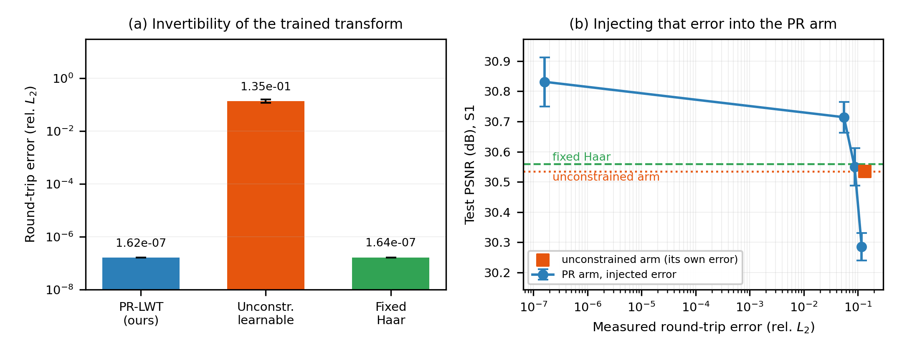

**图 16 — 初始化距离 → 训练后 drift**（`fig16_e3_initdrift.png`）
(a) 从 $d \in \{0, 0.5, 1, 2\}$ 出发，训练后 drift 全部落在 **0.654–0.775**
（起点跨度 2.0，终点跨度 0.12）；从 $d=0$ **出发会被推远**到 0.775，即
梯度不认为 Haar 最优。(b) $d=4$ 的起点闭环已达 $4.3\times10^1$，训练后
drift 与 PSNR 都**纹丝不动**（3.29 dB）—— 数值崩溃是**悬崖不是斜坡**。

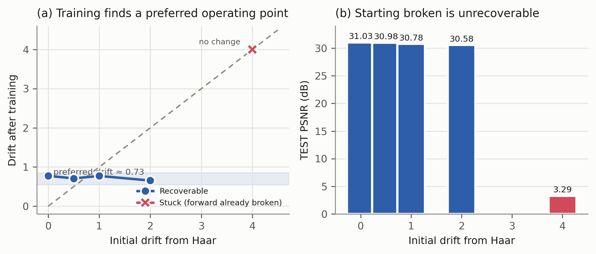

**图 17 — bound → drift → PSNR 的机制链**（`fig17_bound_drift.png`）
横轴是**实际 drift**（不是 bound），使 E3 的独立测量能直接叠上去。
默认 `bound=0.5` 把优化压在 drift 0.23，远低于曲线平台的 0.65–0.78。

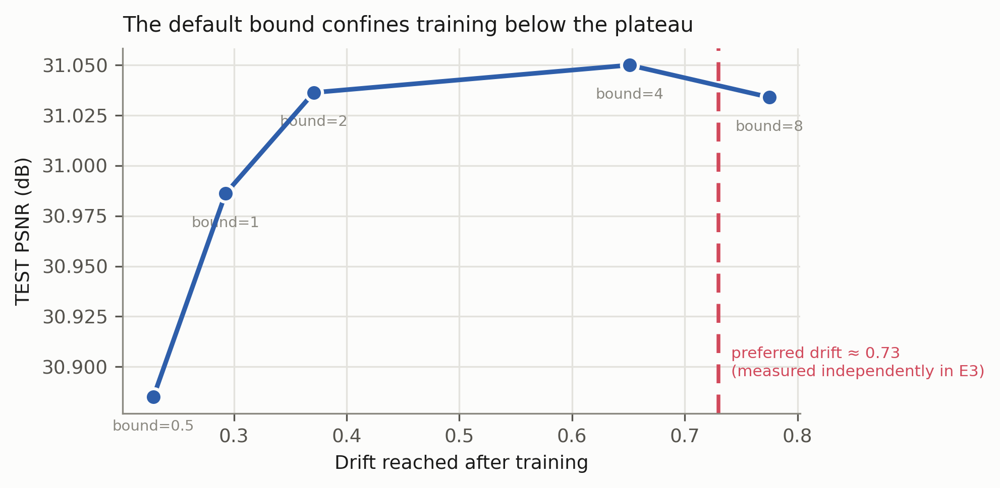

### B.2 主结果与效率（fig1、fig4、fig3）

**图 1 — 三臂对照**（`fig1_arms.png`）柱状 + 误差棒 + 配对 $p$ 值，
虚线为 S1 测试集上的 identity 地板。模型必须越过这条线才有意义。

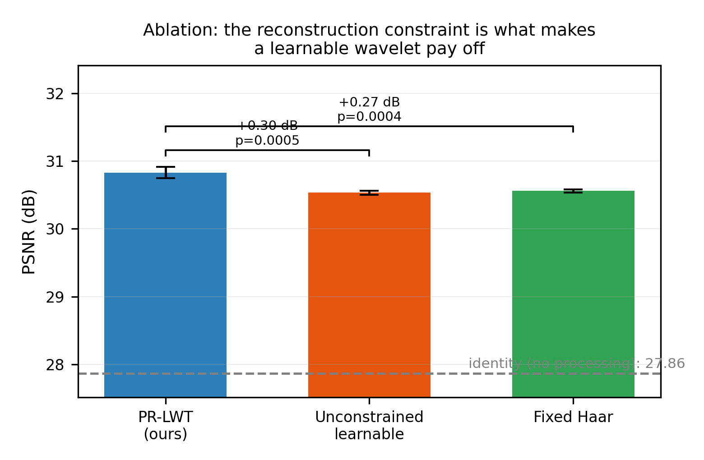

**图 4 — 参数效率**（`fig4_pareto.png`）参数量 vs PSNR（L506）。
点线为 RED-CNN 的同划分复现（32.9471，距已发表 32.93 仅 0.02 dB）。
本文方法以 **857× 更少参数**落在 1.0 dB 以内。

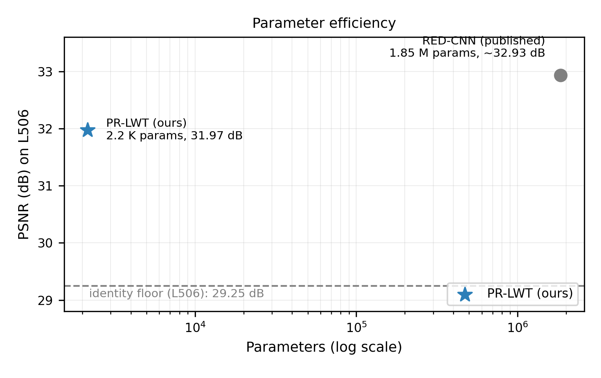

**图 3 — 视觉对比**（`fig3_visual.png`）L506 上低剂量输入 / identity /
本文结果 / 全剂量参考，以及各自与参考的绝对误差（HU）。

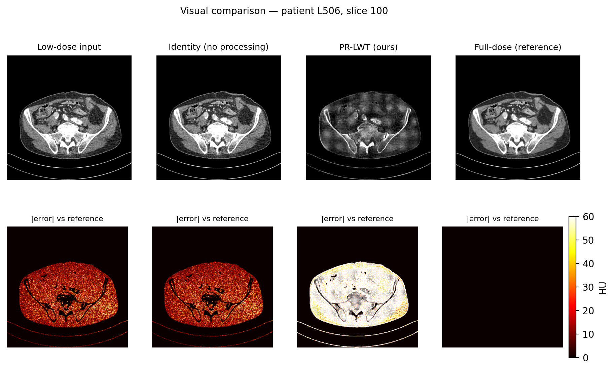

### B.3 复现研究（fig10–fig14）

**图 10 — 独立复现**（`fig10_replication.png`）原数据（435 片，$n=5$）与
重新获取的数据（421 片，$n=10$）上三臂并排，排序与差距不变。

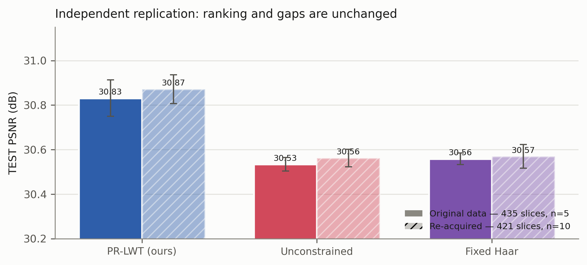

**图 11 — bound 剂量-响应曲线**（`fig11_bound_curve.png`）见 §5.4。
标题刻意克制为"性能对 bound 取值不敏感"，因 $n=3$ 下只有 1.0/2.0 显著优于默认。

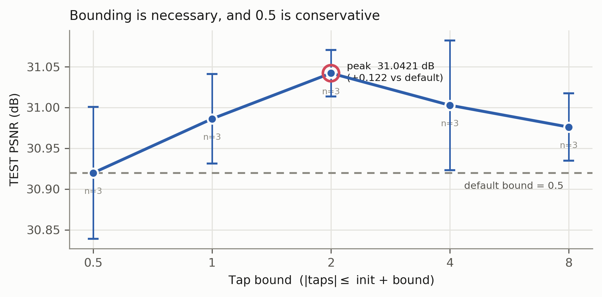

**图 12 — 效应量森林图**（`fig12_effect_forest.png`）原研究 vs 复现研究的
Δ 与 95% CI，含各自的 MDES 带。

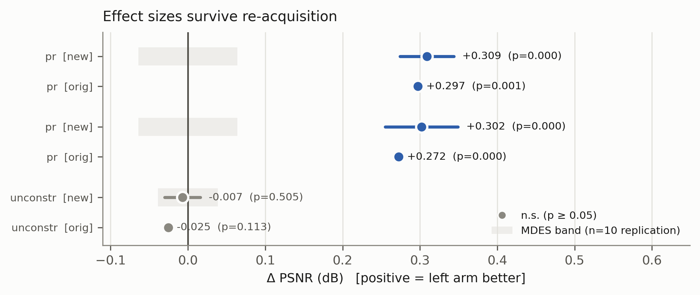

**图 13 — 种子收敛**（`fig13_seed_conv.png`）均值随种子数 $n$ 的收敛
与 95% CI 收窄，横线为论文原值（$n=5$，435 片）。

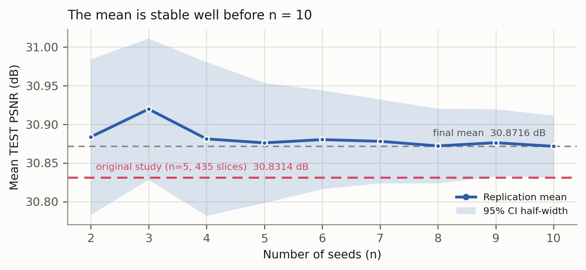

**图 14 — $n=10$ 的功效分析**（`fig14_power_n10.png`）MDES 随 $n$ 的曲线，
叠加实测效应。$n=10$ 的检出下限为 **0.074 dB**，比 $n=5$ 的 0.136 dB 收紧近一倍。

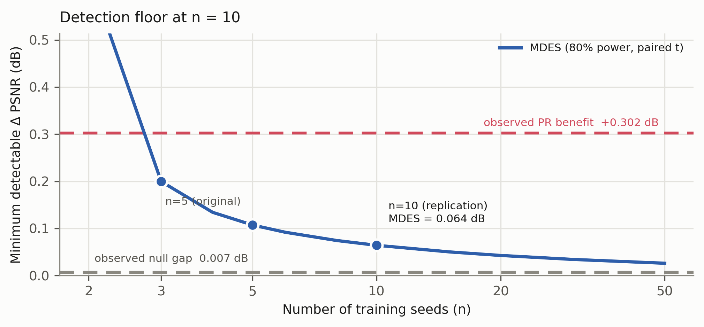

### B.4 统计与稳健性（fig5–fig9）

**图 5 — 逐切片分布与方差分解**（`fig5_slice_dist.png`）
(a) 测试切片上每种子的 PSNR 分布（半小提琴 + 抖动散点，黑线为四分位与中位数）。
三臂的分布**几乎完全重叠**，说明效应不是被少数切片带出来的。
(b) 方差分解：**逐切片** SD（1.75–1.80 dB）比**种子间** SD（0.030–0.087 dB）
大 **20–60 倍** —— 这是"以种子而非切片为分析单元"的直接依据。

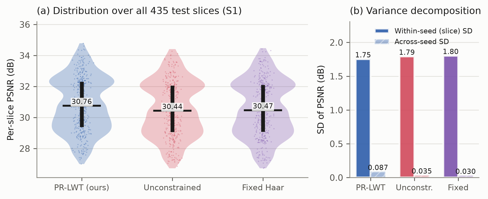

**图 6 — 收敛动力学**（`fig6_convergence.png`）
(a) 训练 L1、(b) 验证 PSNR，各三臂 5 种子均值 ± 1 SD。
PR-LWT 在**两个**指标上都优于另两臂（末轮 train L1 0.003346 vs 0.003396/0.003414）。
(b) 中虚线标出**所有种子最优轮次均为第 30 轮**——即训练尚未收敛（见 §6 局限 3）。

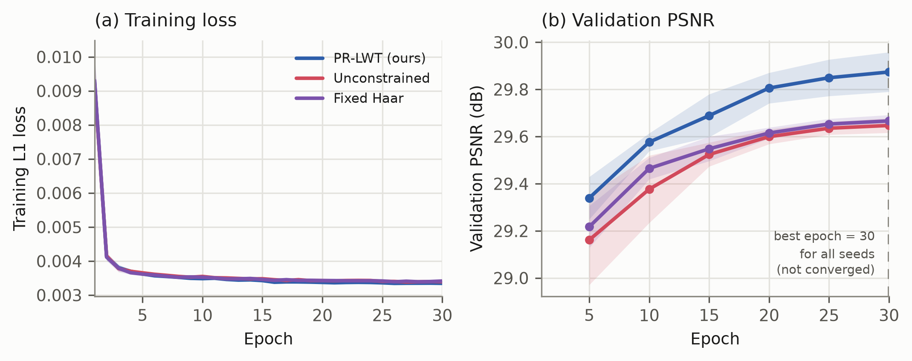

**图 7 — 效应量森林图**（`fig7_forest.png`）
六个配对比较的 Δ 与 95% CI。灰带为该 $n$ 下的 MDES 区间（"这个样本量测不出来的范围"）。
两个零结果**完全落在灰带内**，而两个显著结果的 CI 整体在灰带之外。

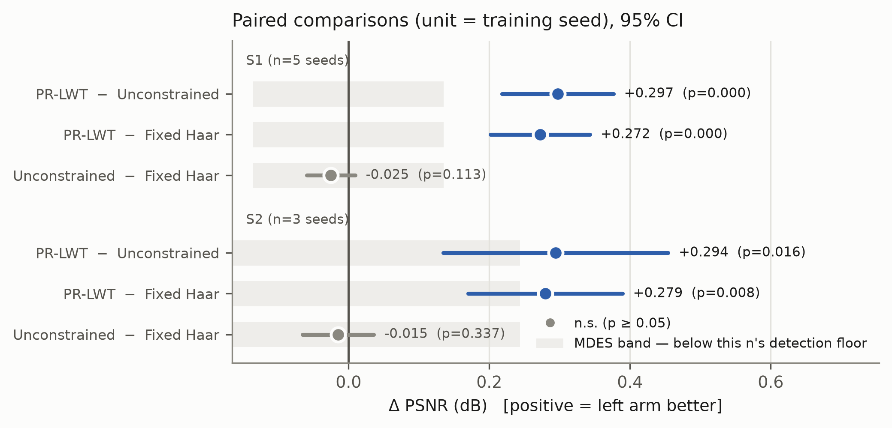

**图 8 — 功效曲线**（`fig8_power.png`）
MDES 随种子数 $n$ 的变化。虚线为实测效应：PR 的收益（+0.272 dB）在 $n=5$ 的
检出线（0.136 dB）**之上**，而 unconstrained–fixed 的差距（0.025 dB）在其**之下 5.6 倍**。

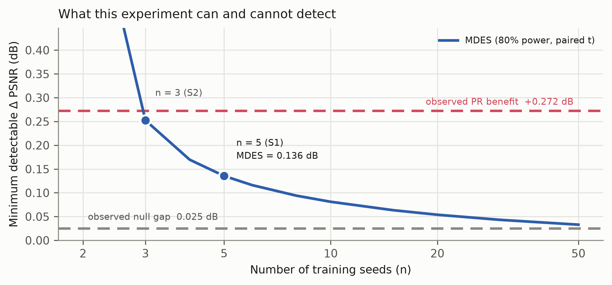

**图 9 — 逐患者一致性**（`fig9_perpatient.png`）
(a) L506（n=211）与 L067（n=224）上效应方向一致；
(b) 两患者的 identity 地板相差 **2.69 dB**，大于本文报告的任何效应 —— 逐患者报告与
以种子为单位的必要性再次可见。

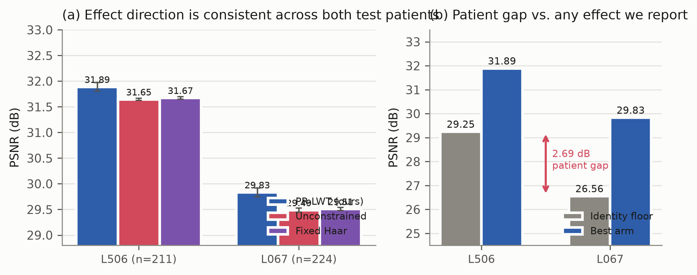

### B.5 新实验：容量假设（fig15）

**图 15 — 变换收益 vs 头容量**（`fig15_e1_capacity.png`）
**否定结果**：假设是"头越小、变换越值钱"，实测方向相反且单调
（+0.186 @94 参数 → +0.284 @2,159 → +0.304 @18,399）。图如实呈现，含端点档
仅 $n=3$ 的限制。用途是**排除**"变换只是替弱小的头补课"这一解释。

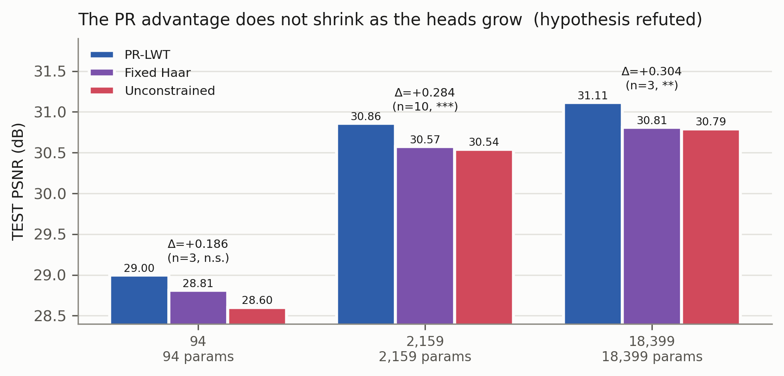

---

## 附录 A：复现

```bash
cd LDCT
python data/prepare_aapm.py                          # DICOM -> HDF5
python experiments/train.py --baseline-only          # identity floor
for w in pr unconstrained fixed; do
  python experiments/train.py --tag ${w}_s0 --wavelet $w \
      --epochs 30 --patch 128 --batch-size 8 --seed 0
done
python experiments/analyze_arms.py --prefix w3_      # S1
python experiments/analyze_arms.py --prefix lit_     # S2
```

每次运行的完整配置（数据量、参数构成、LR 衰减点、代码版本）见
`experiments/runs/<tag>/config.json`；逐样本指标见同目录 `results.json`。
